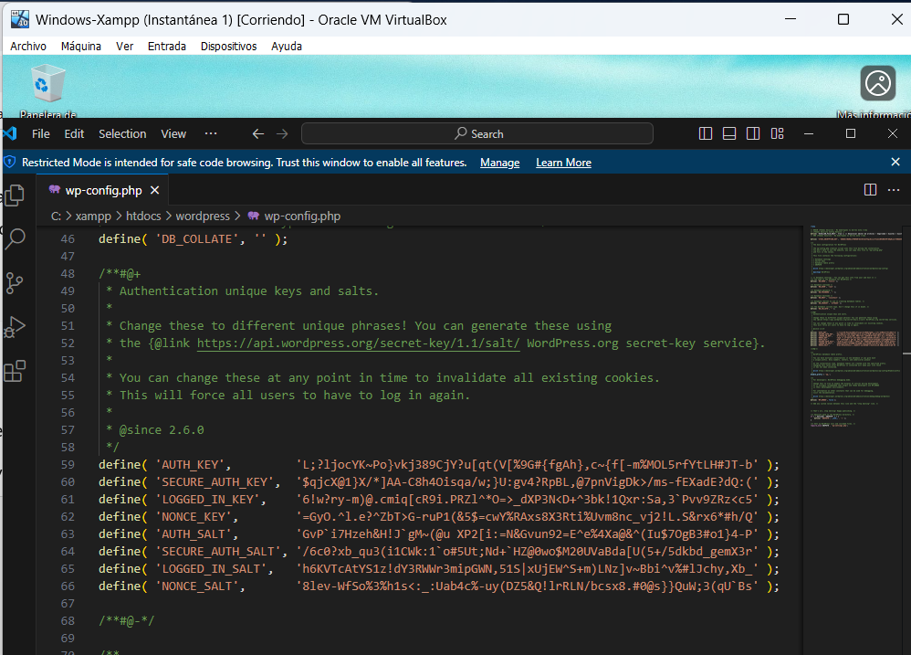
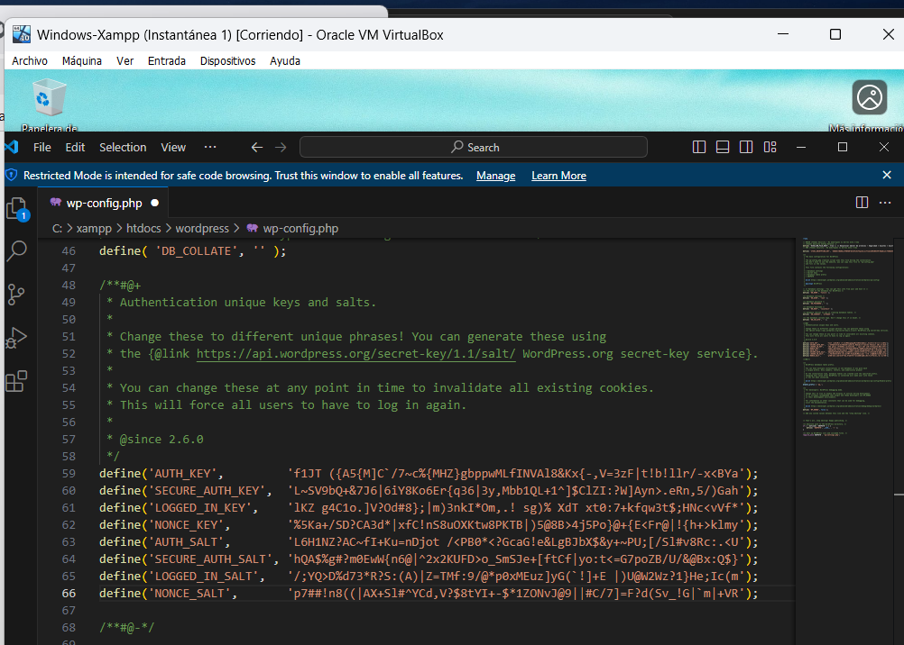

# Hardening-WordPress

## Descripción del proyecto

Este documento técnico describe las acciones llevadas a cabo para aplicar medidas de hardening (refuerzo de seguridad) en una instalación de WordPress.  

Se han implementado al menos 5 prácticas recomendadas, de acuerdo con la guía de seguridad de SiteGround.

---

## Acciones de seguridad implementadas

### 1. Configurar las claves de seguridad de Wordpress (Keys y Salt)

Primeramente tenemos que acudir a la siguiente página [generación de claves](https://api.wordpress.org/secret-key/1.1/salt/) En este enlace nos generará unas claves aleatorias.

Una vez las tengamos vamos a sustituirlas por las que tenemos en el archivo **wp-config.php**. Para ello abrimos este archivo que lo tenemos en la raíz de nuestro proyecto.

Vemos que actualmente tenemos estas claves:

Y tras generar las claves y sustituirlas, ahora nos aparecen las siguientes:

Con esto se consigue que Cualquier sesión activa anterior se invalida y será necesario volver a iniciar sesión.

---

### 2. Deshabilitar la edición de ficheros desde el panel de administración de WordPress

Si un atacante consigue acceso al panel, podría inyectar código malicioso directamente.

Para esto hay que agregar una constante al archivo wp-config.php para desactivar esta funcionalidad.

Abrimos el archivo wp-config.php y antes de dónde ponga: 

'/*That's all, stop editing! Happy publishing.*/'

añadimos la siguiente línea:

'define('DISALLOW_FILE_EDIT', true);'

Tal y como se muestra en la imagen

---

## Script de automatización

Se incluye un [script](./script.sh) que automatiza las acciones anteriores.
