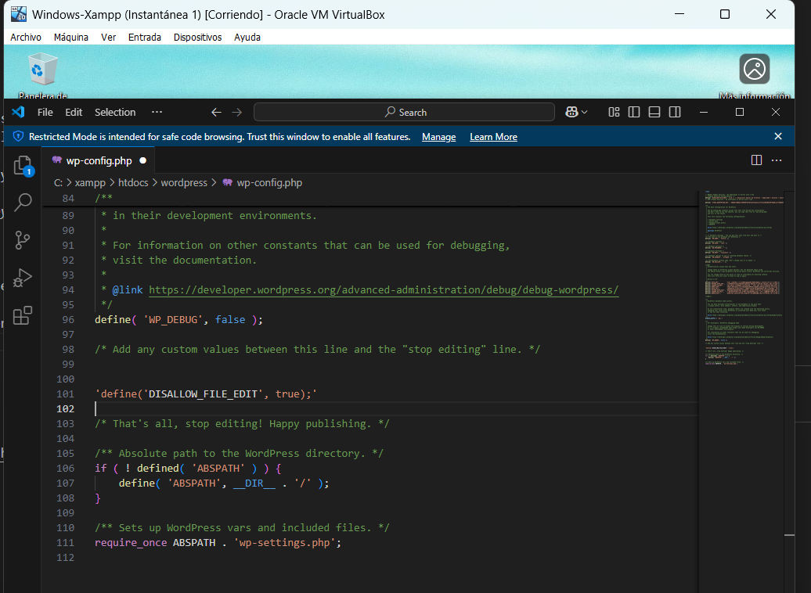
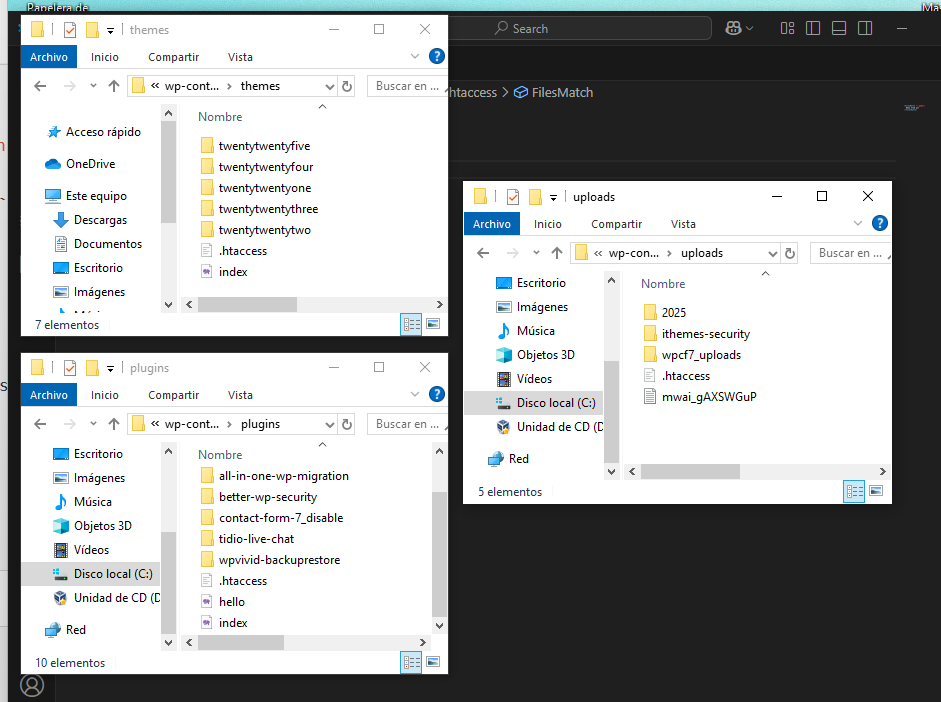

# Hardening-WordPress

## Descripción del proyecto

Este documento técnico describe las acciones llevadas a cabo para aplicar medidas de hardening (refuerzo de seguridad) en una instalación de WordPress.  

Se han implementado 5 prácticas recomendadas.

Indicar que el proyecto de wordpress realizado anteriormente fue sobre window con lo que la ejecución manual se hará sobre la máquina virtual windows ya creada con el proyecto y el script se adaptará para sistema linux tal y como indica el ejercicio.

---

## Acciones de seguridad implementadas

### 1. Configurar las claves de seguridad de Wordpress (Keys y Salt)

Primeramente tenemos que acudir a la siguiente página [generación de claves](https://api.wordpress.org/secret-key/1.1/salt/) En este enlace nos generará unas claves aleatorias.

Una vez las tengamos vamos a sustituirlas por las que tenemos en el archivo **wp-config.php**. Para ello abrimos este archivo que lo tenemos en la raíz de nuestro proyecto.

Vemos que actualmente tenemos estas claves:


Y tras generar las claves y sustituirlas, ahora nos aparecen las siguientes:


Con esto se consigue que Cualquier sesión activa anterior se invalida y será necesario volver a iniciar sesión.

---

### 2. Deshabilitar la edición de ficheros desde el panel de administración de WordPress

Si un atacante consigue acceso al panel, podría inyectar código malicioso directamente.

Para esto hay que agregar una constante al archivo wp-config.php para desactivar esta funcionalidad.

Abrimos el archivo wp-config.php y antes de dónde ponga: 

'/*That's all, stop editing! Happy publishing.*/'

añadimos la siguiente línea:

'define('DISALLOW_FILE_EDIT', true);'

Tal y como se muestra en la imagen



---

### 3. Modificar los permisos de los archivos y directorios. Los archivos deben ponerse a 644 y los directorios a 755

**644** → Archivos: el propietario puede leer y escribir; los demás solo pueden leer.

**755** → Directorios: el propietario puede leer, escribir y ejecutar; los demás pueden leer y ejecutar.

Indicamos en el script los comandos a utilizar esta modificación

---

### 4. Bloquear la ejecución de código PHP en los siguientes directorios: wp-content/uploads, wp-content/plugins y wp-content/themes

Si un atacante logra subir un archivo .php, podría ejecutarlo y comprometer el sitio.

Lo que vamos a hacer, primero de manera manual para ver qué es lo que hay que realizar, es que en cada uno de esos directorios crearemos un fichero .htaccess y en el meterermos las siguientes líneas

```xml
<FilesMatch "\.php$">
  Deny from all
</FilesMatch>
```

Así denegamos cualquier intento de ejecutar archivos .php


Vemos el archivo creado en las tres ubicaciones



---

### 5. Desactivar el acceso al archivo xmlrpc.php con reglas en un archivo .htaccess

Con esta medida se mitigan ciertos ataques automatizados y abusos del sistema de XML-RPC en WordPress.

En el directorio raíz de WordPress, buscamos el archivo .htaccess y lo abrimos. Añadiremos las siguientes líneas sl final:

```xml
<Files xmlrpc.php>
    Order Deny,Allow
    Deny from all
</Files>
```


---

## Script de automatización

Indicar aquí que el script se realiza en bash, según especificaciones del ejercicio, pero los cambios en wordpress para especificar estas acciones de seguridad se hacen sobre windows ya que en su momento el ejercicio lo tenía realizado en una máquina virtual de windows.

Se incluye un [script](./script.sh) que automatiza las acciones anteriores.
